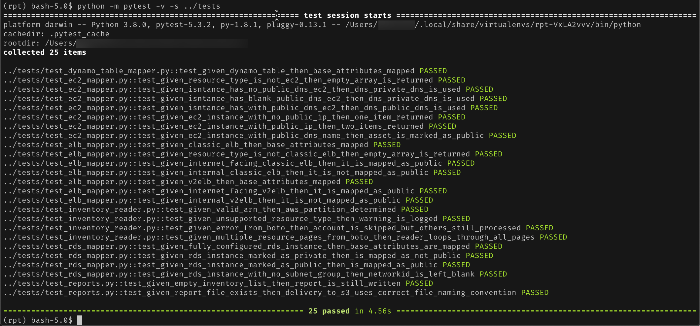
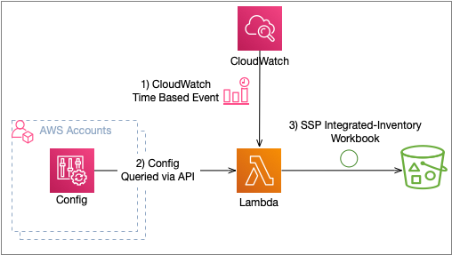
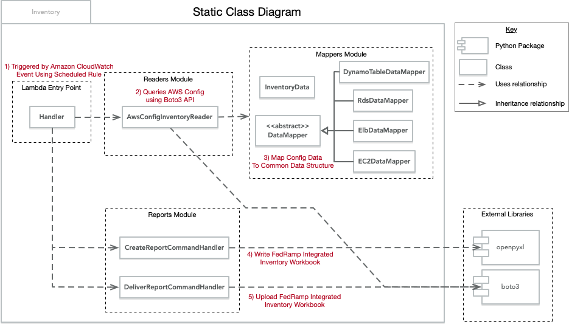
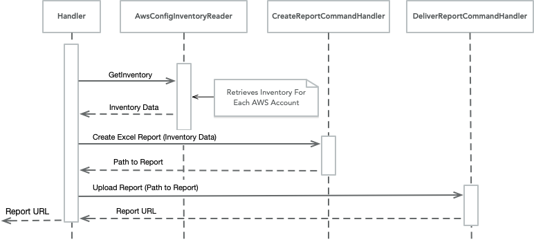
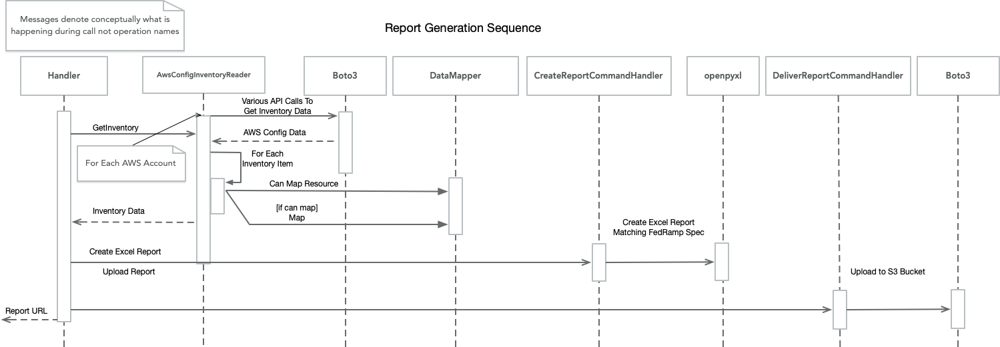
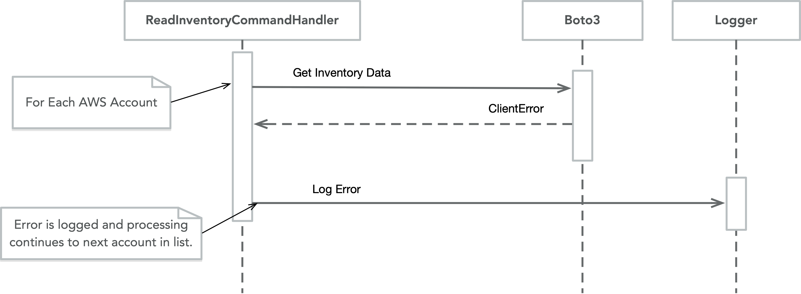
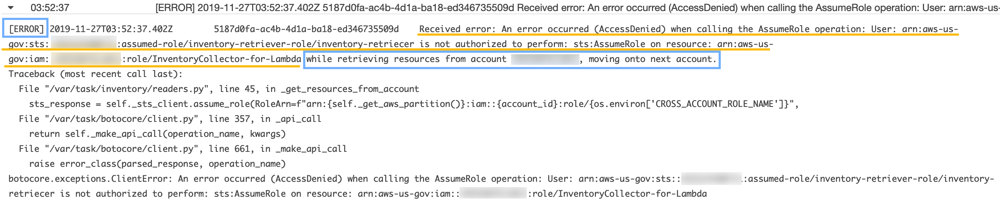

# FedRAMP Integrated Inventory Workbook Generator

## License

This library is licensed under the MIT-0 License. See the LICENSE file.

Additionally, this project installs the following software for the purposes of deploying and running the labs into the lab environment:

* [openpyxl](https://openpyxl.readthedocs.io/en/stable/index.html) package. Python open source software is provided under the MIT/Expat License.
* [pytest](https://docs.pytest.org/en/latest/) package. Python open source software is provided under the MIT License.
* [pylint](https://pylint.readthedocs.io/en/latest/) package. Python open source software is provided under the GNU General Public License.
* [mypy](http://mypy-lang.org/) package. Python open source software is provided under the MIT License.
* [autopep8](https://github.com/hhatto/autopep8) package. Python open source software is provided under the MIT License.
* [callee](https://callee.readthedocs.io/en/latest/reference/general.html) package. Python open source software is provided under the BSD 3-Clause "New" or "Revised" License.

## Overview

This sample shows how you can create a Lambda function to retrieve inventory information to create the integrated inventory spreadsheet which can be used as a separate attachment to the FedRAMP System Security Plan (SSP) and is the repository associated to the [Automating creation of a FedRAMP Integrated Inventory Workbook](https://aws.amazon.com/blogs/publicsector/automating-creation-fedramp-integrated-inventory-workbook/) blog post. The spreadsheet template can be found [here](https://www.fedramp.gov/new-integrated-inventory-template/).

This sample populates the inventory spreadsheet with a point in time view of a subset of all AWS resources spanning multiple AWS accounts. The following resource types are currently supported AWS::EC2::Instance, AWS::ElasticLoadBalancingV2::LoadBalancer, AWS::ElasticLoadBalancing::LoadBalancer, AWS::DynamoDB::Table, AWS::RDS::DBInstance.

There are other assets that must be tracked in the spreadsheet (e.g. software running on EC2 instances/containers) which this sample does not gather. The design does lend itself to be extended to gather inventory information from multiple sources for various resource types.

## Contents

This project follows the [src project structure](https://blog.ionelmc.ro/2014/05/25/python-packaging/). In other words, this:
```
├─ src
│  └─ packagename
│     ├─ __init__.py
│     └─ ...
├─ tests
│  └─ ...
```

Additionally, here are notes of other key files/folders not typically found in a Python project:

* **package.sh** - This script bundles the package so that it can be uploaded to Lambda. However, a Lambda package .zip file is already included with the repository. This requires the setup of a virtual environment using pyenv. [AWS Serverless Application Model](https://aws.amazon.com/serverless/sam/) was not used in an effort to minimize the number of concepts introduced.

## Running the Code
The code was developed using Python 3.8, pyenv, and pipenv. After cloning the repository locally, create a virtualenv however you prefer. Both a requirements.txt file and Pipfile have been provided, for example if you have Python 3.8 installed and set at the current version, you can run the following commands in the project directory:

``` bash
python -m venv .
source ./bin/activate
```

Install the package, its dependencies and dev dependencies. Dev dependencies are not included in the requirements.txt as pipenv is used for dependency management, and requirements.txt was created without including dev dependencies. For ease of getting up an running though, you can execute the following commands:

``` bash
python -m pip install -r requirements.txt
python -m pip install pytest
python -m pip install callee
cd src
python -m pytest -v -s ../tests
```

If you've got everything installed correctly, you should see output similar to:



### Development
The project was developed using Visual Studio Code and the .vscode directory with three launch configuration is included. Among them is "Run All Tests" configuration which can be used to run all unit tests in the project. Unit tests mock out calls to AWS services so you do not need to worry about tests using the services when executed. A .env.sample file is included which you can use to set the environment variables used by Visual Studio Code. If the .env file is not recognized by Visual Studio Code, ensure that the "python.envFile" setting is set to "${workspaceFolder}/.env".

### Environment Variables

* **AWS_REGION** - AWS region from which the AWS Config resources will be queried
* **ACCOUNT_LIST** - JSON document containing the list of accounts that need to be queried for inventory with the following structure
``` json
[ { "name": <AWS ACCOUNT NAME>, "id": <AWS ACCOUNT NUMBER> } ]
```
* **CROSS_ACCOUNT_ROLE_NAME** - Name of the role that will be assumed on the accounts where inventory needs to be retrieved
* **REPORT_TARGET_BUCKET_PATH** - Prefix of the S3 object key for the report. Similar to foler path to where the report will be uploaded
* **REPORT_TARGET_BUCKET_NAME** - Name of the S3 bucket where report will be uploaded (without "s3://")
* **LOG_LEVEL (Optional)** - Default of INFO. The package uses the STL's logger module and any of the [log levels](https://docs.python.org/3/library/logging.html#levels) available there can be used.
* **REPORT_WORKSHEET_NAME (Optional)** - Default of "Inventory". Name of the worksheet in the "SSP-A13-FedRAMP-Integrated-Inventory-Workbook-Template" spreadsheet where inventory data will be populated.
* **REPORT_WORKSHEET_FIRST_WRITEABLE_ROW_NUMBER** (Optional) - Default of 6. Row number (not index) of where inventory data will start to be populated.

## Design
This section contains the design details of this package.

### Items In Scope
* Gather inventory information from AWS Config and deliver to S3

### Items Out-of-Scope / Possible Next Steps
* Errors while retrieving inventory from AWS accounts are logged as errors but processing continues. Raising a CloudWatch event for these errors so that alerts can be created could be a next step.
* Account list is provided via an Environment Variable, using either AWS Organizations to gather the list of member accounts or using a centralized store where this list is maintained could be a next step.
* Publishing metrics is out of scope
* Software/Container inventory is out of scope
* Use of structured logging is out of scope
* Access to the report is out of scope. This project merely drops the file in S3
* Code Coverage, and CI/CD pipeline are out of scope
* Using [AWS Serverless Application Model](https://aws.amazon.com/serverless/sam/) is out of scope

### Conceptual Design


The above diagram depics the conceptual design. As you can see, the Lambda function can be triggered by a CloudWatch event, gathers inventory information from AWS Config and persists the Workbook into a S3 bucket.

### Static Relationships


The above diagram shows the modules that make up the inventory package and relationships between them. 

Classes in the Readers and Reports modules implement the [Command Handler pattern](https://blogs.cuttingedge.it/steven/posts/2011/meanwhile-on-the-command-side-of-my-architecture/). To keep things simple and given that dependency injection is not used, method arguments are not represented as Command classes.

The Handler module contains the Lambda entry point that acts as the coordinator of the AwsConfigInventoryReader which is responsible for retrieving inventory information, CreateReportCommandHandler which is responsible for creating the inventory report spreadsheet, and the DeliverReportCommandHandler which is responsible for uploading the spreadsheet to S3.

The Mappers module is composed of a class hierarchy that implements the [Data Mapper pattern](https://martinfowler.com/eaaCatalog/dataMapper.html), providing a well known extensibility point for adding additional classes to map new resource types. The result of data mapping is a list of InventoryData instances. The goal is to normalize the various data structures retrieved from AWS Config into a single type which can then be used by the CreateReportCommandHandler to populate the inventory spreadsheet.

### Dynamic Behavior
The following section details this package's runtime behavior of the major components

#### Report Generation


Before we get into the details, lets look at sequence of steps and the classes that the Lambda Handler module uses to create the inventory report. As you can see, the Handler needs to directly interact with only three classes, AwsConfiInventoryReader, CreateReportCommandHandler and DeliverReportCommandHandler, whose names imply their responsibility. Now let's take a bit of a more detailed look at the call sequence.



The above sequence diagram depicts the report generation process in its entirety. Most of the complexity is centered around the retrieval and mapping the AWS Config data into a normalized structure. It is the AwsConfigInventoryReader's resposibility to return this normalized structure. As AwsConfigInventoryReader iterates through each AWS Config resource, it queries the list of DataMappers to determine which can handle the item. Once all AWS Config resources have been mapped into an InventoryData instance, the list is returned to the Handler.

The Handler subsequently calls the CreateReportCommandHandler and DeliverReportCommandHandler to create the inventory spreadsheet and upload it to S3 respectively.

#### Error Handling


As depicted above, errors encountered during the retrieval of inventory information from AWS Config, are logged; however, processing continues. Below is a screenshot from CloudWatch showing the log entry with specific sections of the log entry highlighted.

